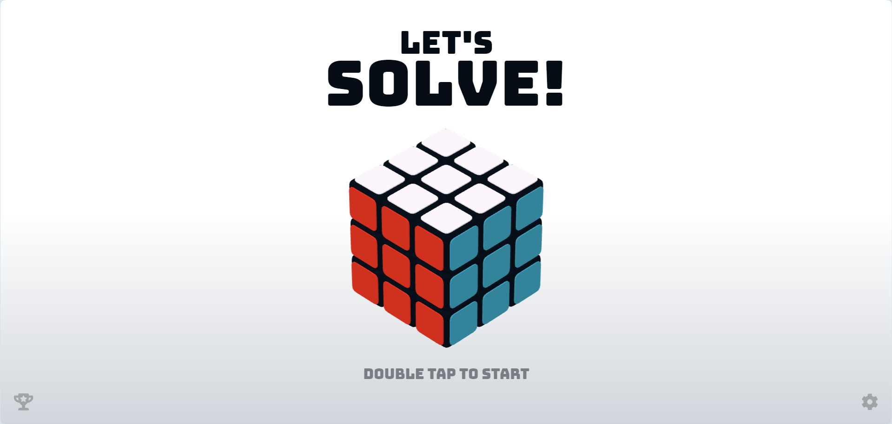
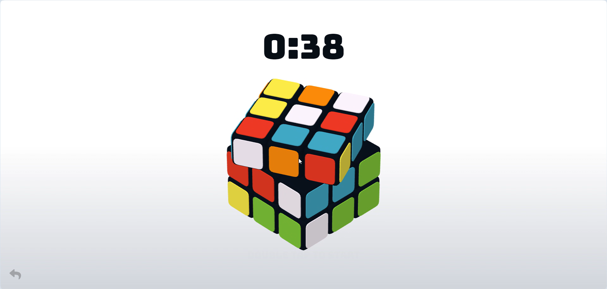
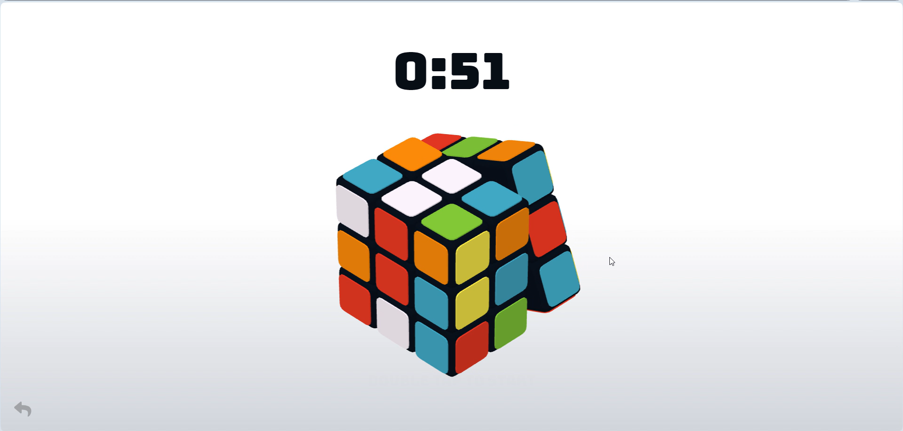
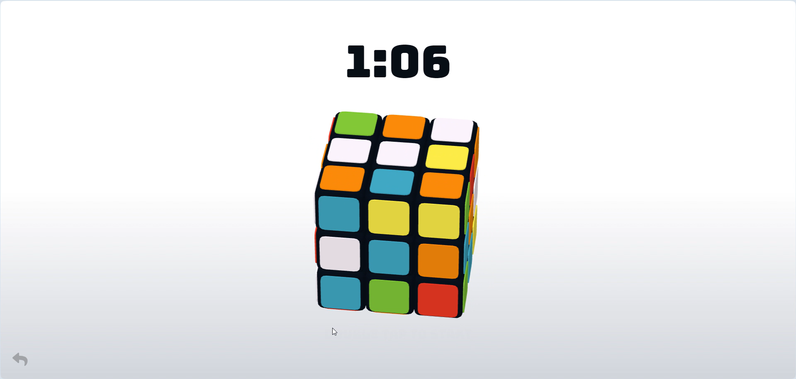
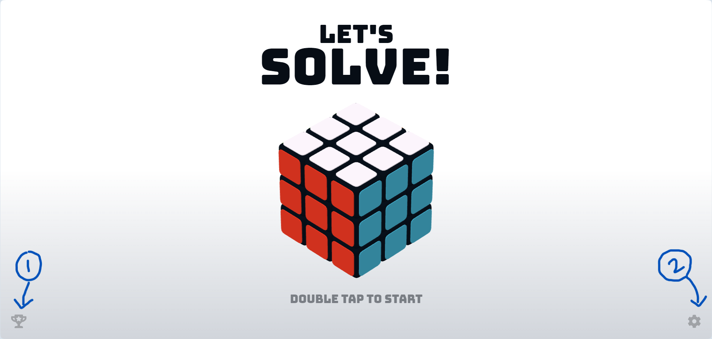
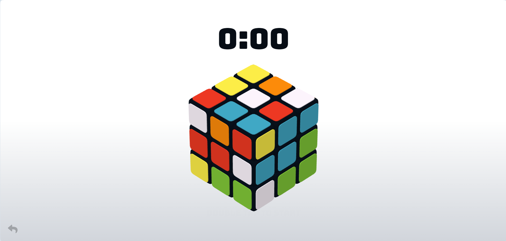
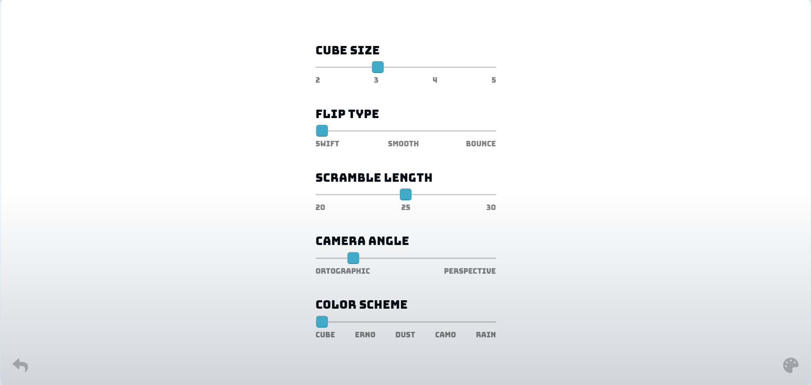
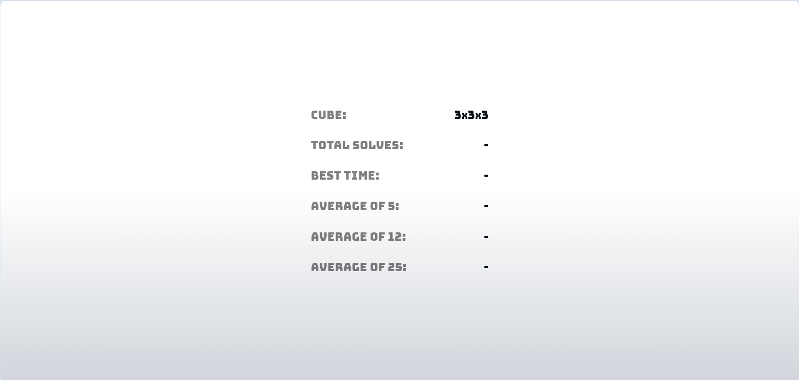

<h1>Rubik-Cube</h1>

Link to game demo: <a href="https://dev-tanay.github.io/Rubik-Cube/">https://dev-tanay.github.io/Rubik-Cube/</a>




<h2>About the Game</h2>
<p>This is a simple and elegant game where you can play Rubik's Cube from your own web browser.</p>
<p>Each of the six faces of the Rubik's cube is in one of the six colors - red, green, yellow, blue, white, and orange.<p>
<p>The visible part of the cube is divided into 26 pieces - 6 central pieces (only one colored side), 12 edge pieces (two colored sides), and 8 corner pieces (three colored sides).</p>
<p>The 26 pieces are "scrambled" to have different colors on each face.</p>
<h2>How to Play</h2>
<p>The objective of this game is to get each face of the cube to have a single color.</p>
<p>This can be done in two ways:</p>
<ol type="i">
<li>Twisting the segments</li>
<p>This can be done by dragging the cursor over the segment you want to rotate.</p>


<li>Changing the view of the cube</li>
<p>This can be done by dragging the cursor in an arrow around the cube.</p>

</ol>
<h2>Installation</h2>
<ol type="i">
<li>Clone the repository</li>
  
```
git clone https://github.com/Dev-tanay/Rubik-Cube.git
```

<li>Navigate to the cloned repository</li>

```
cd Rubik-Cube
```

<li>Open the index.html file in a web browser</li>
</ol>
<br>
<p>There, you've opened the game screen!</p>
<h2>Navigating the Game Screen</h2>
<ul>
<li>Home</li>

<br>
<p>You'll see two icons, each on the two bottom corners of the screen. They're (1) Leaderboard and (2) Preferences.</p>

You can start the game by double-clicking on the text "DOUBLE TAP TO START"
<li>Game start</li>

<br>
<p>Once you start the game, a timer will show above the cube. </p>
Now you'll see only one icon, that is Back.<br>
<li>Preferences</li>

<br>
<p>On clicking Preferences from Home screen, you'll be led to the settings page.</p>
<p>The options you can change here are:</p>

i. Cube size<br>
ii. Flip Type<br>
iii. Scramble<br>
iv. Camera Angle<br>
v. Color Scheme<br>

<p>Also, there are two new icons in the bottom corners - (3) Back and (4) Theme. </p>
<li>Theme</li>

<br>
<p>Here, you can adjust the hue, saturation, and lightness of the screen to your liking.</p>

The new icons in the bottom corners are - (5) Back and (6) Reset
<li>Stats</li>

<br>
These display the statistics of your Rubik's Cube game. The stats include:
i. Total Number of Solves<br>
ii. Best time<br>
iii. Average of 5, 12, 25<br>
</ul>
</ul>

<h3>LICENSE</h3>

This project is licensed under the MIT License - see the LICENSE file for details.