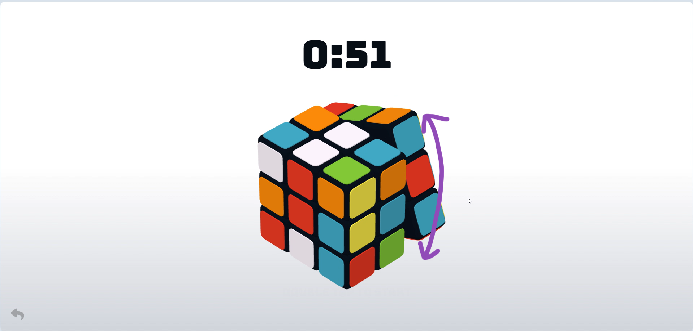

# Rubik-Cube

<p align="center">
  <a href="https://github.com/Dev-tanay/Rubik-Cube/issues">
    
  </a>
  <a href="https://github.com/Dev-tanay/Rubik-Cube/network/members">
    
  </a>
  <a href="https://github.com/Dev-tanay/Rubik-Cube/stargazers">
    
  </a>
  <a href="https://github.com/Dev-tanay/Rubik-Cube/blob/main/LICENSE">
    
  </a>
  <a href="https://dev-tanay.github.io/Rubik-Cube/">
    
  </a>
</p>

## 🌐 Link to Game Demo
<a href="https://dev-tanay.github.io/Rubik-Cube/">https://dev-tanay.github.io/Rubik-Cube/</a>


## 📖 About the Game
This is a simple and elegant game where you can play Rubik's Cube from your own web browser.

- Each of the six faces of the Rubik's cube is in one of the six colors - red, green, yellow, blue, white, and orange.
- The visible part of the cube is divided into 26 pieces:
  - 6 central pieces (one colored side)
  - 12 edge pieces (two colored sides)
  - 8 corner pieces (three colored sides)
- The 26 pieces are "scrambled" to have different colors on each face.

## 🕹️ How to Play
The objective of this game is to get each face of the cube to have a single color.

This can be done in two ways:

1. **Twisting the Segments**
   - This can be done by dragging the cursor over the segment you want to rotate.
   
   

2. **Changing the View of the Cube**
   - This can be done by dragging the cursor in an arrow around the cube.
   

## 🧩 Installation Guide for Rubik-Cube

Follow the steps below to install and set up the Rubik-Cube project on your local machine.

### 📋 Prerequisites
- Ensure you have `git` installed on your system. If not, download and install it from [here](https://git-scm.com/).
- A modern web browser (e.g., Chrome, Firefox, Edge).

### 🛠️ Steps

1. **🔗 Clone the Repository**
   Open your terminal (or Command Prompt on Windows) and run the following command to clone the repository:
   ```sh
   git clone https://github.com/Dev-tanay/Rubik-Cube.git
   ```

2. **📂 Navigate to the Cloned Repository**
   Change directory to the cloned repository:
   ```sh
   cd Rubik-Cube
   ```

3. **🌐 Open the Index.html File**
   Locate the `index.html` file in the repository and open it in your web browser. You can do this by either:
   - **Double-clicking the `index.html` file** in your file manager. This will open the file in your default web browser.
   - **Running a simple HTTP server** (if you prefer):

     **Using Python (if installed):**
     ```sh
     python -m http.server
     ```
     Open your web browser and go to `http://localhost:8000`.

     **Using Node.js (if installed) with http-server package:**
     ```sh
     npx http-server
     ```
     Open your web browser and go to the provided local server URL (usually `http://127.0.0.1:8080` or similar).

4. **🎮 Play the Game**
   Once the `index.html` file is opened in the web browser, the game screen will be displayed. You can now start playing the Rubik-Cube game.

### ℹ️ Notes
- Ensure your browser allows running JavaScript, as the game likely depends on it.
- If you encounter any issues, check the browser console for error messages and ensure all assets are properly loaded.

Enjoy your Rubik-Cube game! 🕹️✨

## 🧭 Navigating the Game Screen
- **Home**
  
  - You'll see two icons at the bottom corners of the screen: (1) Leaderboard and (2) Preferences.
  - You can start the game by double-clicking on the text "DOUBLE TAP TO START".

- **Game Start**
  
  - Once you start the game, a timer will show above the cube.
  - Now you'll see only one icon, which is Back.

- **Preferences**
  
  - Clicking Preferences from the Home screen will lead you to the settings page.
  - Options available for customization:
    - Cube size
    - Flip Type
    - Scramble
    - Camera Angle
    - Color Scheme
  - Two new icons in the bottom corners: (3) Back and (4) Theme.

- **Theme**
  
  - Here, you can adjust the hue, saturation, and lightness of the screen.
  - New icons in the bottom corners: (5) Back and (6) Reset.

- **Stats**
  
  - Displays statistics of your Rubik's Cube game, including:
    - Total Number of Solves
    - Best time
    - Average of 5, 12, 25

## 📜 License
This project is licensed under the MIT License - see the [LICENSE](LICENSE) file for details.