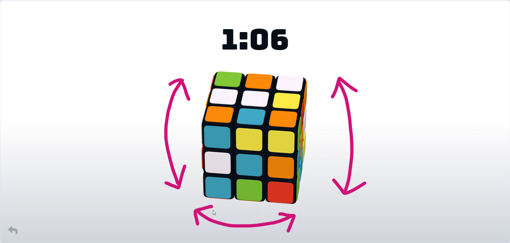
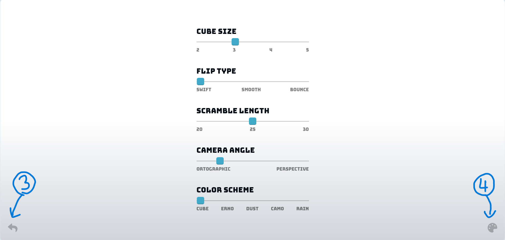
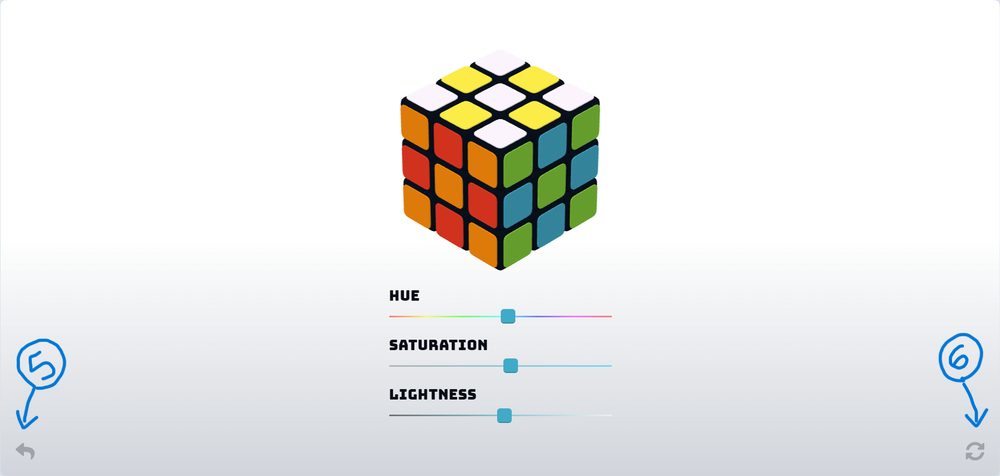

<h1>Rubik-Cube</h1>

 
 
  
  
  
  

<h2>Link to Game Demo</h2>
<a href="https://dev-tanay.github.io/Rubik-Cube/">https://dev-tanay.github.io/Rubik-Cube/</a>

<h2>About the Game</h2>

This is a simple and elegant game where you can play Rubik's Cube from your own web browser.

Each of the six faces of the Rubik's cube is in one of the six colors - red, green, yellow, blue, white, and orange.

The visible part of the cube is divided into 26 pieces:

<ul>
  <li>6 central pieces (one colored side)</li>
  <li>12 edge pieces (two colored sides)</li>
  <li>8 corner pieces (three colored sides)</li>
</ul>

The 26 pieces are "scrambled" to have different colors on each face.

<h2>How to Play</h2>

The objective of this game is to get each face of the cube to have a single color.

This can be done in two ways:

<ol type="i">
  <li>Twisting the segments</li>
  
This can be done by dragging the cursor over the segment you want to rotate.

  
  
  <li>Changing the view of the cube</li>
  
This can be done by dragging the cursor in an arrow around the cube.

  
</ol>

<h2>Installation</h2>
<ol type="i">
  <li>Clone the repository</li>
  <pre><code>git clone https://github.com/Dev-tanay/Rubik-Cube.git</code></pre>
  <li>Navigate to the cloned repository</li>
  <pre><code>cd Rubik-Cube</code></pre>
  <li>Open the <code>index.html</code> file in a web browser</li>
</ol>

There, you've opened the game screen!

<h2>Navigating the Game Screen</h2>
<ul>
  <li>Home</li>
  
  
You'll see two icons, each on the two bottom corners of the screen. They're (1) Leaderboard and (2) Preferences.

  
You can start the game by double-clicking on the text "DOUBLE TAP TO START"

  <li>Game start</li>
  
  
Once you start the game, a timer will show above the cube.

  
Now you'll see only one icon, that is Back.

  <li>Preferences</li>
  
  
On clicking Preferences from Home screen, you'll be led to the settings page.

  
The options you can change here are:

  <ul>
    <li>Cube size</li>
    <li>Flip Type</li>
    <li>Scramble</li>
    <li>Camera Angle</li>
    <li>Color Scheme</li>
  </ul>
  
Also, there are two new icons in the bottom corners - (3) Back and (4) Theme.

  <li>Theme</li>
  
  
Here, you can adjust the hue, saturation, and lightness of the screen to your liking.

  
The new icons in the bottom corners are - (5) Back and (6) Reset.

  <li>Stats</li>
  
  
These display the statistics of your Rubik's Cube game. The stats include:

  <ul>
    <li>Total Number of Solves</li>
    <li>Best time</li>
    <li>Average of 5, 12, 25</li>
  </ul>
</ul>

<h3>LICENSE</h3>

This project is licensed under the MIT License - see the <a href="LICENSE">LICENSE</a> file for details.

